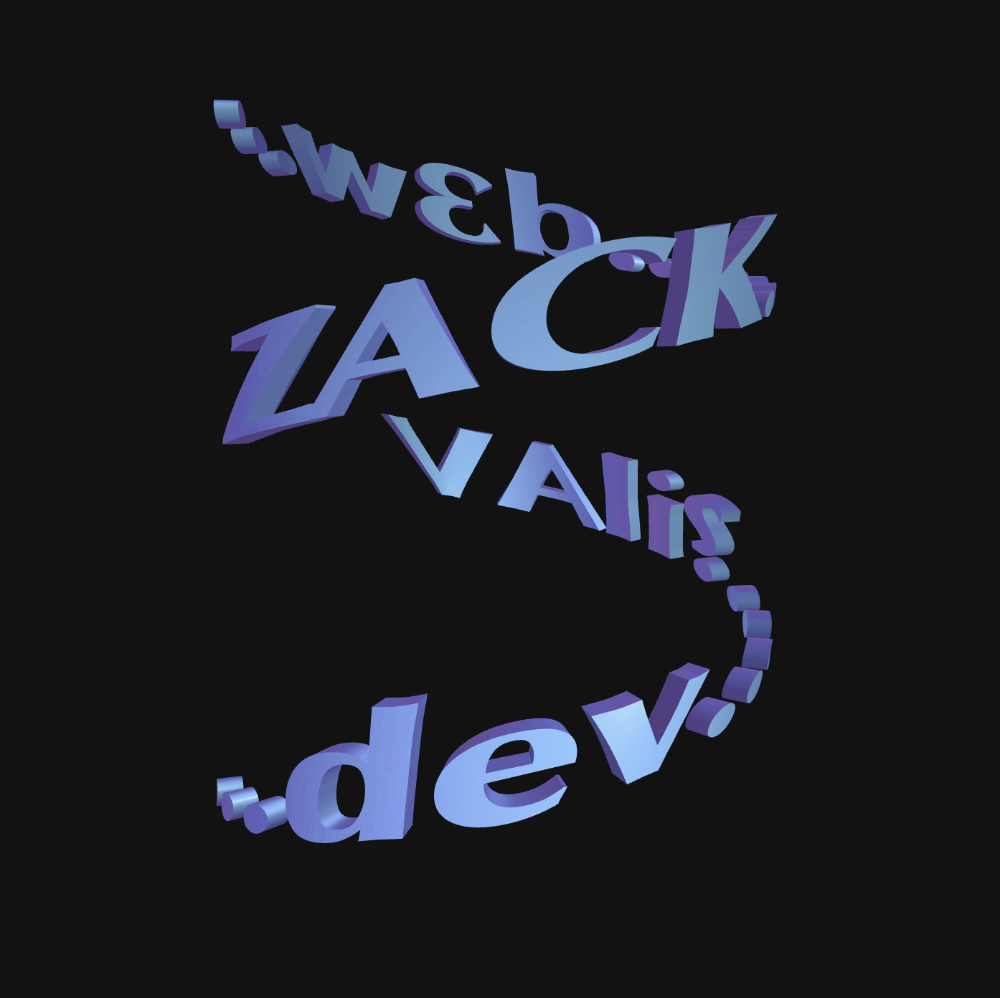

<!-- Improved compatibility of back to top link: See: https://github.com/othneildrew/Best-README-Template/pull/73 -->
<a name="readme-top"></a>

[![Contributors][contributors-shield]][contributors-url]
[![Forks][forks-shield]][forks-url]
[![Stargazers][stars-shield]][stars-url]
[![Issues][issues-shield]][issues-url]
[![MIT License][license-shield]][license-url]
[![LinkedIn][linkedin-shield]][linkedin-url]

<!-- PROJECT LOGO -->
<br />
<div align="center">
  <a href="https://github.com/Spakicey/zvalis_web">
    
  </a>

<h3 align="center">Zack Valis Portfolio Website</h3>

  <p align="center">
    This is my personal site! Built with a React frontend, Django backend, and SQLite/Postgres database
    <br />
    <a href="https://github.com/Spakicey/zvalis_web"><strong>Explore the docs »</strong></a>
    <br />
    <br />
    <a href="WEB URL">View Site</a>
    ·
    <a href="https://github.com/Spakicey/zvalis_web/issues">Report Bug</a>
    ·
    <a href="https://github.com/Spakicey/zvalis_web/issues">Request Feature</a>
  </p>
</div>

<!-- TABLE OF CONTENTS -->
<details>
  <summary>Table of Contents</summary>
  <ol>
    <li>
      <a href="#about-the-project">About The Project</a>
      <ul>
        <li><a href="#built-with">Built With</a></li>
      </ul>
    </li>
    <li>
      <a href="#getting-started">Getting Started</a>
      <ul>
        <li><a href="#installation">Installation</a></li>
      </ul>
    </li>
    <li><a href="#todo-list">TODO List</a></li>
    <li><a href="#license">License</a></li>
    <li><a href="#contact">Contact</a></li>
    <li><a href="#acknowledgments">Acknowledgments</a></li>
  </ol>
</details>

<!-- ABOUT THE PROJECT -->
## About The Project

[![Website Screenshot][site-screenshot]](https://github.com/Spakicey/zvalis_web)

I want to have my own little corner of the intenet with this website! Since I know how to code, I figured I'd code my website from the ground up, teach myself some new things along the way, and show off a little bit of my personality!

Some cool things I learned:
* React JS
* THREE.js
* SCSS
* How to deploy a webapp

<p align="right">(<a href="#readme-top">back to top</a>)</p>

### Built With

* [![React][React.js]][React-url]
* [![Django][Django]][Django-url]
* [![SCSS][SCSS]][SCSS-url]

<p align="right">(<a href="#readme-top">back to top</a>)</p>

<!-- GETTING STARTED -->
## Getting Started

If you would like to clone the repo and play around with this code, try using the following installations steps.

### Installation

1. Create a virtual environment to begin the project setup (there are many ways to create a venv)
    ```sh
   pyenv virtualenv APP_NAME
   ```
    ```sh
   pyenv activate APP_NAME
   ```
2. Once you have the venv set up, clone the repo
    ```sh
    git clone "https://github.com/Spakicey/zvalis_web"
    ```
3. Switch to the backend directory and install the required packages
   ```sh
   cd backend
   ```
   ```sh
   pip install -r requirements.txt
   ```
4. The react app has a package.json that contains all necessary packages, so run the following commanands
   ```sh
   cd frontend
   ```
   ```sh
   npm install
   ```
   ```sh
   npm audit fix
   ```
5. Once you have the necessary packages for both Django and React, it's time to start each server.
   Make sure to run each server in separate tabs with the env active on both
   ```sh
   cd backend
   ```
   ```sh
   python manage.py runserver
   ```
   it should run on something like 127.0.0.1:8000
   ```sh
   cd frontend
   ```
   ```sh
   npm start
   ```
   should run on localhost:3000

<p align="right">(<a href="#readme-top">back to top</a>)</p>

<!-- ROADMAP -->
## TODO List

- [ ] Scale drawn images to mobile in yokoland.js
- [ ] Have the transparent layer in gifs not overwrite previous drawn images in yokoland.js
- [ ] Fix bugs in yokoland.js
    - [ ] Back-to-back gifs will post the first frame of the next gif on mouseup
    - [ ] Sometimes a still image will not be drawn on mousedown, only until mousemove
- [ ] Add more projects to the Work section
- [ ] Figure out a free and straightforward way to host a simple full stack web app (if that exists?)

<p align="right">(<a href="#readme-top">back to top</a>)</p>

<!-- LICENSE -->
## License

Distributed under the MIT License. See `LICENSE.txt` for more information.

<p align="right">(<a href="#readme-top">back to top</a>)</p>

<!-- CONTACT -->
## Contact

Zack Valis - [@Spakicey](https://instagram.com/spakicey) - zackvalis@gmail.com - [LinkedIn](https://linkedin.com/in/zvalis)

Project Link: [https://github.com/Spakicey/zvalis_web](https://github.com/Spakicey/zvalis_web)

<p align="right">(<a href="#readme-top">back to top</a>)</p>

<!-- ACKNOWLEDGMENTS -->
## Acknowledgments

* [Oluwadare Oluwaseyi [Stylistic Inspiration + SCSS Code]](https://www.seyi.dev/)
* [Isaac Fayemi [Stylistic Inspiration]](https://www.fayemi.design/)
* [Yuri Artiukh AKA "Akella" [THREE.js Text Code]](https://www.github.com/akella)
* [ABSURD 3D YouTube Channel [Camera Position Logger Code]](https://youtu.be/1Hg6gQs4RDQ?si=HN8MF0tKU9uMr9jJ)
* [Rik Lomas [Version 1 Image Drawing Code]](https://library.superhi.com/posts/making-a-clickable-digital-collage-with-javascript)

<p align="right">(<a href="#readme-top">back to top</a>)</p>

<!-- MARKDOWN LINKS & IMAGES -->
<!-- https://www.markdownguide.org/basic-syntax/#reference-style-links -->
[contributors-shield]: https://img.shields.io/github/contributors/Spakicey/zvalis_web.svg?style=for-the-badge
[contributors-url]: https://github.com/Spakicey/zvalis_web/graphs/contributors
[forks-shield]: https://img.shields.io/github/forks/Spakicey/zvalis_web.svg?style=for-the-badge
[forks-url]: https://github.com/Spakicey/zvalis_web/network/members
[stars-shield]: https://img.shields.io/github/stars/Spakicey/zvalis_web.svg?style=for-the-badge
[stars-url]: https://github.com/Spakicey/zvalis_web/stargazers
[issues-shield]: https://img.shields.io/github/issues/Spakicey/zvalis_web.svg?style=for-the-badge
[issues-url]: https://github.com/Spakicey/zvalis_web/issues
[license-shield]: https://img.shields.io/github/license/Spakicey/zvalis_web.svg?style=for-the-badge
[license-url]: https://github.com/Spakicey/zvalis_web/blob/master/LICENSE.txt
[linkedin-shield]: https://img.shields.io/badge/-LinkedIn-black.svg?style=for-the-badge&logo=linkedin&colorB=555
[linkedin-url]: https://linkedin.com/in/zvalis
[site-screenshot]: images/site-screenshot.png
[React.js]: https://forthebadge.com/images/badges/made-with-javascript.svg
[React-url]: https://reactjs.org/
[Django]: https://forthebadge.com/images/badges/made-with-python.svg
[Django-url]: https://djangoproject.com
[SCSS]: https://forthebadge.com/images/badges/uses-css.svg
[SCSS-url]: https://sass-lang.com/
